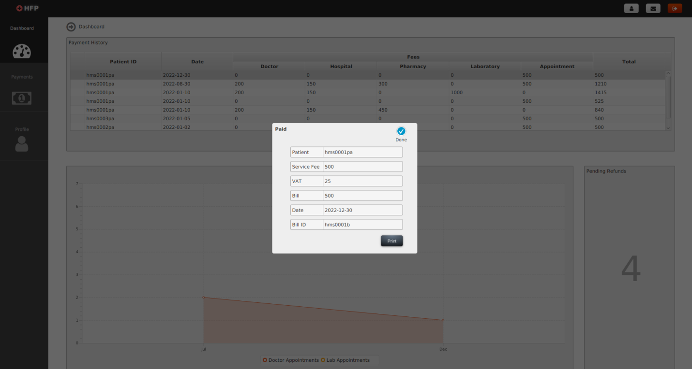

# Project Title

Pharmacy Management System

## Description

<p align="justify">
The expansion of e-commerce has made it possible for anybody to access things on the internet market. The selling of commodities, including drugs, is made easier by the web in addition to facilitating access to data. In the next years, demand for online or electronic pharmacies (e-pharmacies) will increase. The phrase "online pharmacy" refers to both legal and illegal pharmacies that offer prescription meds via the internet. Although the idea of selling medications outside of traditional brick and mortar pharmacies is not unique, it has gained popularity in the digital age. Access to the internet has grown thanks to technological developments. Pharmaceutical procedures have thus developed through time to completely include all facets of pharmacy itself. These procedures comprise medication administration, consulting, drug control, and drug sales.

</p>

<p align="justify">
The proprietor of healthcare pharmaceuticals has come to understand the advantages of using information technology. To effectively run the pharmacies and provide customer service, the investor has made the decision to create a new management system. Consumers and pharmacist employees will be able to a win-win experience enhanced with interaction and participation in real-time thanks to the pharmacies control system.
</p>

<p align="justify">
For both commercial and wholesale pharmacists, the new Health First Pharmacy Management System (HFPMS) technology will be employed. Instead of manually capturing the data, which would put the company at greater risk of losing and maintenance, the program will handle all generated data for a pharmacist to sustain the business. The stock has many differences, making it difficult for the pharmacy personnel to identify all of the customers' data. The proper equipment, knowledge, and funds will be available to the pharmacist staff to improve and assist controller, evaluation, therapy, and money planning. The proprietor will be able to administer online courses using the HFPMS, which also allows management of medicines, preparation of medication for patients, distribution of prescriptions, registration of all new items, and management of users, including staff and patient records. The new technology would enable online bill payment and patient-doctor communication for patients.
</p>

## Table of Contents

- [Project Title](#project-title)
  - [Description](#description)
  - [Table of Contents](#table-of-contents)
  - [Key Features](#key-features)
    - [Use Case Diagram](#use-case-diagram)
    - [Class Diagram](#class-diagram)
    - [Sequence Diagram](#sequence-diagram)
  - [System Requirements](#system-requirements)
  - [Getting Started](#getting-started)
  - [Proposed Solution](#proposed-solution)
    - [**Login Page**](#login-page)
    - [**Admin**](#admin)
      - [**Admin Dashboard**](#admin-dashboard)
      - [**Admin System Menu**](#admin-system-menu)
      - [**Admin Profile**](#admin-profile)
      - [**Admin’s access to patient reports**](#admins-access-to-patient-reports)
      - [**Admin’s access to lab reports**](#admins-access-to-lab-reports)
      - [**Admin’s access to appointments**](#admins-access-to-appointments)
      - [**Admin’s access to appointment cancellation**](#admins-access-to-appointment-cancellation)
      - [**Admin’s access to pharmacy stock**](#admins-access-to-pharmacy-stock)
      - [**Admin’s access to pharmacy suppliers**](#admins-access-to-pharmacy-suppliers)
      - [**Admin’s access to income info**](#admins-access-to-income-info)
    - [**Manager**](#manager)
      - [**Manager Dashboard**](#manager-dashboard)
      - [**Manager’s payment management**](#managers-payment-management)
      - [**Manager Profile**](#manager-profile)
      - [**Manager’s access to view bill**](#managers-access-to-view-bill)
    - [**Doctor**](#doctor)
      - [**Doctor’s Dashboard**](#doctors-dashboard)
      - [**Doctor’s Acount**](#doctors-acount)
      - [**Doctor’s Profile Page**](#doctors-profile-page)
      - [**Doctor Qualification**](#doctor-qualification)
      - [**Doctor Availibility**](#doctor-availibility)
      - [**Doctor’s access to patient’s medical history**](#doctors-access-to-patients-medical-history)
      - [**Doctor access to patient’s test result**](#doctor-access-to-patients-test-result)
      - [**Doctor’s prescription for a patient**](#doctors-prescription-for-a-patient)
    - [**Pharmacist**](#pharmacist)
      - [**Pharmacist Dashboard**](#pharmacist-dashboard)
      - [**Pharmacist’s drug sell page**](#pharmacists-drug-sell-page)
      - [**Pharmacist Acount Page**](#pharmacist-acount-page)
      - [**Pharmacist Profile Page**](#pharmacist-profile-page)
      - [**Pharmacist’s Qualification**](#pharmacists-qualification)
    - [**Receptionist**](#receptionist)
      - [**Receptionist Dashboard**](#receptionist-dashboard)
      - [**Receptionist’s appointment making**](#receptionists-appointment-making)
      - [**Receptionist’s ability to appointment making**](#receptionists-ability-to-appointment-making)
      - [**Receptionist Profile Page**](#receptionist-profile-page)
      - [**Receptionist Acount**](#receptionist-acount)
    - [**Lab Assistant**](#lab-assistant)
      - [**Lab Assistant Dashboard**](#lab-assistant-dashboard)
      - [**Lab Assistant’s capability to generate lab report**](#lab-assistants-capability-to-generate-lab-report)
      - [**Lab Assistant’s Profile Page**](#lab-assistants-profile-page)
      - [**Lab Assistant Acount**](#lab-assistant-acount)
    - [**Log Out Page**](#log-out-page)
  - [Software Development Life Cycle approach](#software-development-life-cycle-approach)
    - [Analysis Stage](#analysis-stage)
    - [Design Stage](#design-stage)
    - [Implementation Stage](#implementation-stage)
    - [Testing Stage](#testing-stage)
    - [Maintenance Stage](#maintenance-stage)
  - [Professional, Legal, Security and Ethical Issues](#professional-legal-security-and-ethical-issues)
    - [Professional Issues](#professional-issues)
    - [Legal Issues](#legal-issues)
    - [Security and Ethical Issues](#security-and-ethical-issues)
  - [End Product](#end-product)
  - [Technical Support](#technical-support)
  - [Contributing](#contributing)
  - [License](#license)

## Key Features

- **User profile creation:** The administrator can add user profiles (such as the management, pharmacists, specialist, secretary, and laboratory technician) to the system.

- **Create backup of existing system:** The administrator may also upgrade the system and generate a backup of it.

- **Maintaining safety and user permission:** The admin can maintain the system's safety and user permissions. The administrator may also examine technical glitches.

- **Maintaining user accounts:** The administrator may provide a list of all user accounts that are currently active, together with information on the different medicine supplies and the salaries of pharmacy employees.

- **Payment management:** The managers are in charge of managing the system in a number of ways, including creating patient invoices, taking payments, issuing refunds. They have the access to see bills and details provided. The manager has the authority to charge customers for services.

- **Maintaining pharmacy inventory:** The pharmacists are in charge of handling medications. They have the ability to dispense medications, check and update pharmacy inventory, remove outdated medications, place sales order for fresh medications, and update medication reports. Additionally, they have access to medicine suppliers and may see prescriptions for patients.
  
- **Issuing prescriptions and lab test:** The doctors can write prescriptions and issue lab test to treat patients. If they believe it is essential, they may amend the medication. Additionally, they have access to information on the patients' medical histories, lab tests, visits, and prescription medications.
  
- **Registering patients:** The receptionists is in charge of registering patients on the system, giving them patient identifiers and assisting them in filling out patient user credentials.
  
- **Scheduling doctor appointments:** In the event that the doctor is available, the receptionists may schedule a meeting for patients. They are also permitted to postpone meetings.

- **Notifying patient appointments to doctors:** The receptionists may also notify physicians about meetings and update patient data. They may see the available physicians and their areas of expertise.

- **Informing lab test findings:** The lab assistant can transmit the test findings to physicians and make any required updates when the test is finished.

### Use Case Diagram
<p align="justify">
A use case diagram describes many system players and also how they interact with each other as well as how they utilize the platform. The term "actors" here refers to any either internal or external entities that communicate with the system or are intended to do so. Additionally, the system's numerous capabilities are shown in the use case diagram. Other justifications for using a use case diagram are as follows:

* Assemble data on the requirements specification
* Explains the connections between the different actors and the necessary conditions.
* Assist in the recognition of the numerous external and internal influences affecting a system.
</p>

The different actors in this situation are including:
* Admin
* Manager
* Pharmacists
* Doctors
* Receptionist
* Lab Assistant

<p align="justify">
Each actor's part is intended to simplify how services are provided to patients. The primary beneficiaries of this approach are the patients.
</p>

<p align="center">
  
</p>
<p align="center">Use Case Diagram of HFPMS </p>

### Class Diagram
<p align="justify">
The class diagram illustrates a relationship between structure by listing the existing system components. Since it describes an object, it also outlines the characteristics of the other classes that are there, how they relate one another and communicate, and the many capabilities that each class does. A UML class diagram is essential in a number of ways, including:

* Explains a program's composition
* A helpful tool for system engineers and programmers
* Updating and develop strategic concepts and case studies might be valuable.

<p align="justify">
The sequence diagrams in this project will list the many structural characteristics of the system.


<p align="justify">
All user in the Health First Pharmacy Management System (HFPMS) inherits the User class. User class characteristics include userID, userName, and userType. A distinct userID and username exist for every sort of user. The need for originality is in place to provide strong security and avoid the system from being accessed by duplicated users.
</p>


    <p align="center">
    Class Diagram of HFPMS </p>

</p>

### Sequence Diagram
<p align="justify">
A sequence diagram shows the series of actions that take place while an agent uses the resource.  The multiple processes in a structure start when an actor takes a variety of actions that function as triggers.  This flow of events must be specified such that both the developer and a non-programmer may comprehend the process flow and monitor each flow of data between and within the platform. Like a consequence, adjustments towards the platform could well be done easily and smoothly, and the model may develop iteratively as the environment changes.
</p>

<p align="justify">
In the following figure, the procedure describes how the administrator registers a new user account. By entering their personal information as well as the necessary information, new users enroll on the site. The admin then assigns a special username and password following verifying the user's information. The administrator grants the user appropriate access to the new user after registration process. 
</p>

<p align="center">
  
</p>
    <p align="center">
    Sequence Diagram of New User Registration by Admin </p>
</p>

## System Requirements

- IDE: Netbeans/Eclipse
- Internet connection: High-speed internet connection is recommended
- OpenJDK 1.8.0_271
- OpenJFX-11.0.2_x64_bin-sdk

## Getting Started

1. Clone the repository to your local machine

    ```
    git clone https://github.com/ornob011/Pharmacy-Management-System
    ```

2. Navigate to the project directory
    ```
    cd Pharmacy-Management-System
    ```

3. Install the required dependencies with your preferred IDE
   

## Proposed Solution
The prototype of the HFPMS has been shown in this section. With the login page, the mentioned actors from the use case diagram can enter into the system. Admin, Manager, Pharmacists, Doctors, Receptionist and Lab Assistant are the actors.

### **Login Page**

Credentials for specific actors have been given below:

|   **Actor**   |  **Username**  | **Password** |
| :-----------: | :------------: | :----------: |
|     Admin     |     admin      |     1234     |
|    Manager    |    manager     |     1234     |
|    Doctor     |   doctor001    |     1234     |
|  Pharmacist   |   pharmacist   |     1234     |
| Receptionist  | receptionist02 |     1234     |
| Lab Assistant |     lab001     |     1234     |

The specified actors can log to the system by using above credentials.

The login page greets the user and asks for their credentials.

<p align="center">
  
</p>

<p align="center">
    Login Page </p>

### **Admin**
#### **Admin Dashboard**
Dashboard of admin to access all user and reports.


    <p align="center">
    Admin Dashboard </p>

#### **Admin System Menu**
Panel to add new user, see current online user and backup the database system. The Admin can also see in a pie chart how many user are using this platform.

    <p align="center">
    Admin System Menu </p>

#### **Admin Profile**
Admin can update his/her profile.

    <p align="center">
    Update Admin Profile </p>


#### **Admin’s access to patient reports**
Number of patients shown in a chart.

    <p align="center">
    Number of patients shown in a chart </p>

#### **Admin’s access to lab reports**
Number of lab reports shown in a pie chart.


    <p align="center">
    Number of lab reports shown in a pie chart </p>

#### **Admin’s access to appointments**
Amount of appointments shown in a chart.

    <p align="center">
    Amount of appointments </p>


#### **Admin’s access to appointment cancellation**
Amount of cancelled appointments depicted in a graph.


    <p align="center">
    Amount of cancelled appointments </p>


#### **Admin’s access to pharmacy stock**
Visualization of pharmacy stock. 


    <p align="center">
    Visualization of pharmacy stock </p>


#### **Admin’s access to pharmacy suppliers**
Visualization of pharmacy suppliers. 


    <p align="center">
    Visualization of pharmacy suppliers </p>

#### **Admin’s access to income info**
Visualization of income over a period of time.


    <p align="center">
    Visualization of income over a period of time </p>

### **Manager**
#### **Manager Dashboard**
Dashboard of manager to see patient fees, pending refunds and visualization of refunds in a chart.


    <p align="center">
    Dashboard of manager </p>


#### **Manager’s payment management**
Search a patient and issue bill.


    <p align="center">
    Manager’s payment management </p>

#### **Manager Profile**
Update profile information


    <p align="center">
    Update manager profile </p>


#### **Manager’s access to view bill**
Status and amount of bill of a certain patient 


    <p align="center">
    Status and amount of bill of a patient </p>


### **Doctor**
#### **Doctor’s Dashboard** 
Dashboard to see all appointments over a period of time, current appointments and patient amount.


    <p align="center">
    Doctor’s Dashboard </p>


#### **Doctor’s Acount**
Acount page to update user name and password.


    <p align="center">
    Update Doctor’s Credentials </p>

#### **Doctor’s Profile Page**
Profile page to update basic info.


    <p align="center">
    Update Doctor’s information </p>


#### **Doctor Qualification**
Qualification and education history of doctor.


<p align="center">
Qualification and education history of doctor </p>


#### **Doctor Availibility**
Specific appointment time of doctor.


<p align="center">
Appointment time of doctor </p>


#### **Doctor’s access to patient’s medical history**
By searching a patient, the doctor can find patient’s medical history from here. 


<p align="center">
Patient’s medical history </p>


#### **Doctor access to patient’s test result**
Test results of patient can be viewed from here.


<p align="center">
Test results of patient </p>


#### **Doctor’s prescription for a patient**
The doctor can prescribe medicine and issue lab test from here.


<p align="center">
Prescribing medicine and issuing lab test by doctor</p>

### **Pharmacist**

#### **Pharmacist Dashboard**
Pharmacist’s dashboard to visualize pharmacy stock, available drugs and suppliers.


    <p align="center">
    Pharmacist Dashboard</p>


#### **Pharmacist’s drug sell page**
Pharmacist can sell drugs from this page to the patient if the patient has been given a prescription. The amount of fee could be calculated.


    <p align="center">
    Pharmacist’s drug sell page </p>


#### **Pharmacist Acount Page** 
Username and password could be updated from here.


<p align="center">
Updating pharmacist's credentials </p>

#### **Pharmacist Profile Page**
Updating profile info is possible from this page.


    <p align="center">
    Updating pharmacist's profile </p>

#### **Pharmacist’s Qualification**
The qualification of pharmacist is shown here.


    <p align="center">
    The qualification of pharmacist </p>


### **Receptionist**

#### **Receptionist Dashboard**
Access to doctor availability, their specialization, currently available doctor and history of appointments can be seen from here. 


    <p align="center">
    Receptionist Dashboard </p>

#### **Receptionist’s appointment making**
Receptionist can make an appointment and cancel it (if necessary) for a patient from this page.


    <p align="center">
    Receptionist’s appointment making </p>


#### **Receptionist’s ability to appointment making**
A successful appointment making is shown here.


<p align="center">
Successful appointment making </p>

#### **Receptionist Profile Page**
Receptionist can update basic profile info.


<p align="center">
Receptionist Profile Page </p>

#### **Receptionist Acount**
Username and password of a receptionist can be updated from here.

<p align="center">
Updating receptionist's credentials </p>


### **Lab Assistant**

#### **Lab Assistant Dashboard**
From dashboard, the lab assistant can see lab appointment and summary of test reports.

<p align="center">
Lab Assistant Dashboard </p>

#### **Lab Assistant’s capability to generate lab report**
The lab assistant can generate lab report if the appointment ID is provided.


<p align="center">
Generating lab report </p>

#### **Lab Assistant’s Profile Page**
Basic info can be updated from here.

<p align="center">
Updating lab assistant’s profile page </p>

#### **Lab Assistant Acount**
Username and password can be updated from here.


<p align="center">
Updating lab assistant’s credentials </p>


### **Log Out Page**

The user will log out by clicking on the button given in this page.
<p align="center">
  
</p>
<p align="center">
Log out page </p>


## Software Development Life Cycle approach

<p align="justify">
Sequences must be followed throughout the software development process in order to produce the finished product on time and in compliance with all stakeholder demands. For ensure accurateness in the final result, the system development process was carried out in accordance with the SDLC methodology. The system was finished on schedule. SDLC is essential because it provides the developer with the best justifications for outlining the project strategy, timetable, and budget. The SDLC technique was used to establish the project deliverables at the outset and track their development throughout. The development process accelerated with adequate planning and monitoring, and risk management was simple since I could schedule any new concerns. Each step of an SDLC methodology is separate. For instance, because the software cannot be built without a precise work design, the design and execution of the software would be difficult without a good knowledge of organisation's needs and specifications. Overall implementation of the software will be slower and more error-prone without the right implementation. On the other hand, a lack of thorough testing for the new features would result in a large number of errors, which would jeopardize the system's security, functionality, stability, and scalability. This suggests that each step of the SDLC is interconnected, and that after a phase has been completed to the team's satisfaction, they should go on to the next one.

</p>

<p align="justify">
For the development of the Health First Pharmacy Management System, I employed the Waterfall SDLC technique. I was able to segregate the whole software creation process into various phases thanks to this methodology. This gave me the opportunity to sequentially utilize the results of one step as critical aspects for the subsequent phases. Waterfall SDLC is a repetitive model that resembles a waterfall in that it views a progressively decreasing flow. Several steps might well be performed out with the framework for effectively design a technology platform.


<p align="center">
Waterfall Model </p>
</p>

### Analysis Stage
<p align="justify">
Every method for creating software begins at this stage. The Software Requirements Specification (SRS) step is another name for the analysis phase. Even during analysis phase, I detailed and characterized the behavior of the online pharmacy management system. I included both the non-functional and the functional criteria for the online platform. To understand the varied needs of the HFPMS, I reviewed the evaluation brief. 

</p>

The operational requirements of the system are including:

<p style="text-align: justify">

* Patient Registering: The program will enable patient registration.
* Making appointments: The solution will enable online doctor appointments.
* Cancelling appointments: The technology will support online appointment cancellation.
* Communication: Email may be used to communicate with patients, physicians, managers, admin staff, and pharmacy employees.
* Changes in appointment: In the event of any appointment changes, the staff may get in touch with the patient and physicians.
* Patient record: Staff members and doctors have access to patient records.
* Update patient record: Patients' records may be updated by the staff.
* Doctor availability: The staff can look up physicians' schedules.
* Medicine prescribe: The physician may write a prescription for medication.
* Updating prescription: The physician may alter the prescription.
* View test results: Doctors have access to lab test results.
* Availability of drugs: The availability of medications may be checked by the physicians.
* Update test results: The laboratory assistant may revise test results.
* Generate bill: The manager may create invoices.
* Bill view: The manager and lab assistant may see the bill.
* Accept fees: The supervisor may take payments.
* Update bill record: A bill record may be updated by the management.
* Refund money: The management may provide a refund.
* Grading: Assignments will be evaluated by the system, and results will be shown on the canvas.

</p>

The non-functional requirements:

<p align="justify">

- User-friendliness: The user interfaces of the online pharmacy management system would be straightforward and intuitive.
</p>

<p align="justify">

- Security: The mechanism for managing internet pharmacies will protect sensitive data.
</p>

<p align="justify">

- Cross-platform: Any device and operating system, including Linux, Windows, Mac, and Android, may access the platform.
</p>
</p>

### Design Stage

<p align="justify">
To discover a solution which met the needs of the user, strategy and problem-solving were required at the construction process. I defined and designed the software system, the diagram design, the conceptual database model, and other things using the Unified Modelling language. To finish the design process, I produced a class diagram, use case model, and sequence diagram.
</p>
<p align="justify">
Sequence diagrams provides a comprehensive breakdown of both the service's users (actors) as well as the interactions that go along with them. I used housing style to describe instances, participants, conditions in the system's use case model.
</p>
<p align="justify">
I created an UML class diagrams to represent the process and explain the classifications, processes, properties, as well as connections between both the items.
</p>
<p align="justify">
Last but not least, I created a sequence diagram to represent the features of the HFPMS. The class diagram aids in illustrating how platform activities are carried out in detail. The actors, object exchanges, and communications were all included in the system's sequence diagram. In order to illustrate the communications' flow, it also contained loops and alternates.
</p>


### Implementation Stage
<p align="justify">
Understanding the numerous needs of the online pharmacy management system is part of this step of the software development process. Using the NetBeans IDE, I created the online pharmacy administration system. I used Java to create the platform's code for managing online pharmacies. Java is a programming language that facilitates the creation of OOP applications. I utilized the JavaFX library to create the system's graphical user interfaces, which enables programmers to include text boxes, labels, buttons, and other elements (GUIs). Additionally, I used MySQL to create the system's database. To guarantee that user data is gathered and securely saved, I connected the system's front-end with the database management system.
</p>

<p align="justify">

- User-friendliness: The user interfaces of the online pharmacy management system would be straightforward and intuitive.
</p>

<p align="justify">

- Security: The mechanism for managing internet pharmacies will protect sensitive data.
</p>

<p align="justify">

- Cross-platform: Any device and operating system, including Linux, Windows, Mac, and Android, may access the platform.
</p>


### Testing Stage
<p align="justify">
To finish the system approvals and verifications, I developed test cases. I tested the system using real user data. Testing phase allowed me to code and evaluate software in parallel, ensuring that the finished output adhered to the basic needs and standards. I used a variety of testing methods to validate and verify the system:
</p>

<p align="justify">

- Unit testing: Testing in the very beginning. I used unit testing to verify sure the program's separate parts were operating properly at the compiled code. Unit testing made code debugging simpler and let me identify problems early.
</p>

<p align="justify">

- Integration testing: Before integrating one system unit with the others, I tested it . I was able to create modules and components that were intended to perform certain actions or tasks thanks to testing phase. In order to confirm that the whole component of the online pharmacy management system functioned as intended, I also evaluated the components in combination. 
</p>

<p align="justify">

- Acceptance testing: I was able to determine if the software prototype was prepared for submit using this testing approach. I made sure the concept complied with the organization's specifications and satisfied those of the users.
</p>

<p align="justify">

- Performance testing: Using performance analysis, I evaluated the system's dependability and efficiency in actual user scenarios. To test if the online pharmacy management system could handle the additional demand, I put an increased quantity of generated demand into it. 

</p>

<p align="justify">

- Security testing: This examination contributed in establishing the security of the data and storage device. I got able to locate safety vulnerabilities and threats inside the online pharmacy management program via vulnerability scanning.
</p>

<p align="justify">

- Usability testing: I used testing process to assess how simple this platform was for end users to use.
</p>


### Maintenance Stage
<p align="justify">
After distribution and deployment, this procedure enables the system developers to upgrade the software. I was able to increase the system outputs, performance, quality, and error correction throughout most of the recovery phase.
</p>

## Professional, Legal, Security and Ethical Issues
### Professional Issues
<p align="justify">
Platforms for managing online pharmacies have various issues. It could be difficult for the physicians and pharmacy personnel to establish a comfortable atmosphere for the patients. Physical examination capabilities are also lacking in internet pharmacies; in certain circumstances, physical evaluation may be preferable to an online setting. Licensed healthcare providers will still question the procedure even after the online examination is completed. Therefore, it will be necessary for the specialists to examine the system in a manner that would benefit both the patients as well as the pharmacy technicians. Another serious professional concern is that patients could take medicine that is inappropriate for them if a prescription is not required. The patient can go to really unwell levels as a result. So, prescriptions are necessary for e-pharmacies. If a patient doesn't always use the same authorized retailer, they might find it challenging to get a new prescription the same day, miss out on personal encounters, and have trouble finding someone to answer any specific questions they may have about treatments.
</p>

### Legal Issues
<p align="justify">
Purchasing prescription drugs from internet pharmacies has a wide range of potential consequences, including various legal difficulties. The patient's entire medical history is often not directly accessible to online pharmacy firms. This means that they may have to blindly accept any instructions that are given to them. This implies that they may have little to no possibility of speaking with the patient directly to ascertain if the drug may jeopardize or hurt them.
</p>
<p align="justify">
Medication that is sold without FDA clearance or approval is referred to as a counterfeit medicine. These medications might be contaminated or have incorrect labels. Some internet pharmacies engage in dishonest business activities, such as selling patients false or subpar pharmaceuticals that may cause major illness or even death.
</p>
<p align="justify">
Online pharmacies sometimes emerge because a particular business is trying to get rid of overstock or recalled medications. These sales are often regarded as unlawful, and patients may suffer catastrophic harm as a consequence.
</p>
<p align="justify">
The stakeholders should make an acceptable usage policy for the pharmacy personnel and customers while establishing the online pharmacy system. This will work as an excellent practice manual to remind users of their various legal responsibilities while using the platform.
</p>

### Security and Ethical Issues
<p align="justify">
Systems used by online pharmacies have a variety of security problems. The system's resources or other crucial assets could be accessible by a malevolent or unapproved individual. An significant asset used in e-pharmacy operations may be accessed by an unauthorized person and modified. The refusal of involvement by patients or staff, denial of service, information exposure, weak encryption, and other issues are additional dangers. In order to secure the safety of the saved assets, the pharmacy should make sure the appropriate security adviser are included into the system. The administrator should also design cybersecurity education and training to inform users about avoiding behaviors that can provide unauthorized users access to the electronic pharmacy systems.
</p>
<p align="justify">
There will be ethical problems with the internet pharmacy system. The new system's primary ethical problem is the violation of privacy. The employees, physicians, administrators, and patients' private information will be collected and stored by the web system. Users will thus be concerned about the confidentiality of their personal information. All users should be informed of the system's privacy practices via a privacy policy that is created. 
</p>

## End Product
<p align="justify">
The development methodology used to create the Health First Pharmacy Management System is explained in this repository. For the online platform to be implemented, system design is crucial. A use case diagram, sequence diagram, and UML class diagrams that outline the online system's structure are included in the report. It also highlights the lessons I learned while creating the HFPMS. I decided to use the Waterfall SDLC paradigm for developing my system. Stages include investigation, development, execution, testing, and maintenance are among the phases that make up the model. The software was created using OOP concepts because they make it simple to retain and change current programs since entities may be created that are just marginally different from ones that are currently in use. The frontend was created using XML, while the backend logic was implemented using Java. Data storage was accomplished using a database system (MySQL). The concerns that come up about professionalism, morality, and security throughout the software development process have been addressed. The HFPMS has undergone a careful examination and been confirmed to comply with the majority of the criteria. I learned a lot from this experience, which I will use in my new career endeavors.
</p>

## Technical Support

For technical support, please email me at [ornob011@gmail.com](mailto:ornob011@gmail.com). I will assist you promptly.

## Contributing

I welcome contributions to this project! If you have an idea for a feature or improvement, or if you have found a bug, please feel free to open an issue in the [issue tracker](https://github.com/ornob011/E-Learning-Platform/issues).

Before submitting a pull request, please make sure to:

- Read and follow our [contribution guidelines](CONTRIBUTING.md).
- Test your changes thoroughly.

Thank you for your contribution!

## License

[](https://www.gnu.org/licenses/gpl-3.0)    


This software is licensed under the GNU General Public License (GPL) version 3.

The full text of the GPL can be found in the `LICENSE` file, or online at <https://www.gnu.org/licenses/gpl-3.0.en.html>


